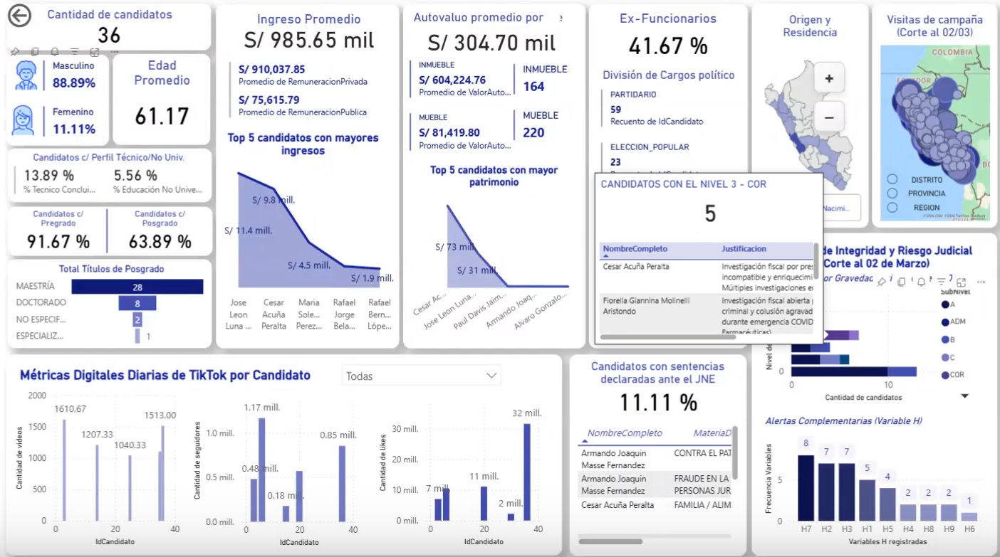
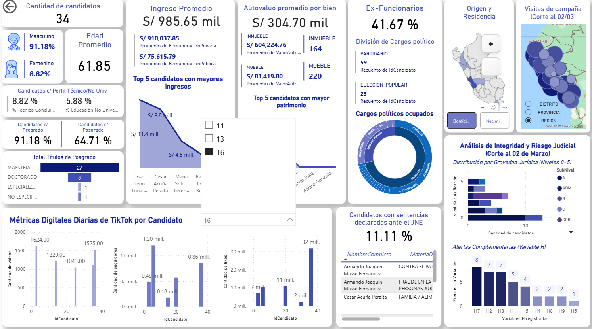
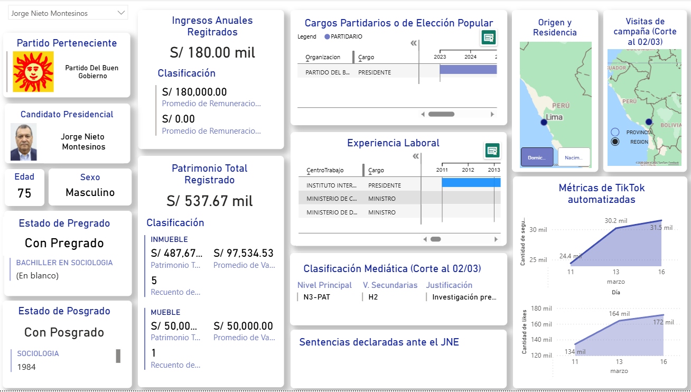
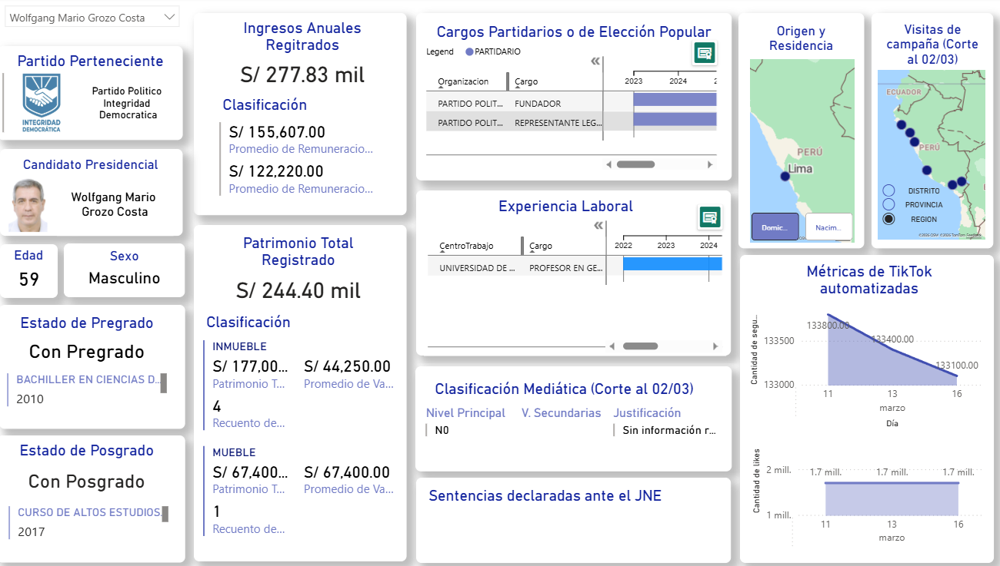

# Data Intelligence: Elecciones Generales Perú 2026
### Sistema de Monitoreo, Riesgo Legal y Análisis de Candidatos

Este repositorio contiene una solución integral de **Ingeniería y Análisis de Datos** diseñada para la fiscalización y el seguimiento estratégico de los candidatos a las elecciones presidenciales y congresales de Perú 2026. 

El proyecto integra múltiples fuentes de datos para evaluar el perfil de los candidatos mediante una matriz de riesgo y métricas de impacto digital.

---

## El Problema y la Propuesta de Valor

### El Desafío
En el contexto electoral peruano, la información sobre los candidatos suele estar dispersa, es difícil de procesar masivamente y carece de un análisis de riesgo estructurado. Esto impide que el ciudadano o el analista identifique patrones de alerta de forma rápida.

### La Solución (Data-Driven Approach)
Como respuesta, diseñé un ecosistema de datos que:
1. **Normaliza la información:** Centraliza 24 dimensiones de datos (desde sentencias hasta educación) en un modelo relacional sólido.
2. **Cuantifica el Riesgo:** Implementa una metodología estadística (N0-N5) para objetivar la idoneidad legal.
3. **Monitorea la Relevancia Social:** Usa Web Scraping para medir el impacto real en plataformas como TikTok, permitiendo cruzar la "popularidad digital" con la "calidad legal".

---

## Galería del Dashboard (Power BI)

> *A continuación, se presentan capturas de pantalla que demuestran cómo la arquitectura de datos en SQL Server y los pipelines de Python se transforman en inteligencia visual para la toma de decisiones.*

### Página 1: Vista General y Análisis de Riesgo
Esta sección ofrece una panorámica del escenario electoral, segmentando a los candidatos por partido, nivel de riesgo legal y métricas clave de educación e ingresos.

  
  

<em>Vista macro de la distribución de candidatos y análisis comparativo de riesgo.</em>

### Página 2: Detalle Individual por Candidato (Ficha Técnica)
*Las capturas identificadas con **`_p2`** corresponden a la segunda página del reporte.* Aquí se despliega una ficha técnica profunda de cada candidato seleccionado, permitiendo una fiscalización individual detallada.

  
  

<em>Ejemplos de fichas individuales: Datos demográficos, historial legal, ingresos y tracking de TikTok.</em>

---

## Stack Tecnológico
* **Engine:** SQL Server (Arquitectura de 24 tablas normalizadas).
* **ETL & Automation:** Python 3.x (Scraping de métricas en tiempo real y procesamiento de datos).
* **Analytics & BI:** Power BI (Modelado de datos y Dashboards interactivos).
* **Librerías Key:** `pandas` para manipulación de datos, `pyodbc` para conectividad SQL y `BeautifulSoup` para extracción web.

---

## Descripción del Sistema

El sistema de análisis electoral presidencial 2026 es una plataforma de inteligencia de datos orientada a integrar, depurar, almacenar y visualizar información pública sobre candidatos, partidos políticos, trayectoria académica, antecedentes legales, ingresos declarados, visitas de campaña y presencia digital.

La solución funciona como un flujo de datos completo: los archivos CSV almacenados en `/data` se cargan mediante procesos ETL hacia una base de datos analítica en Azure SQL; sobre esa base se construyen vistas especializadas para Power BI; finalmente, el dashboard permite consultar indicadores de riesgo, perfiles individuales de candidatos, comportamiento territorial y métricas comparativas para apoyar la fiscalización ciudadana y el análisis estratégico.

### Objetivo General
Desarrollar un sistema de Business Intelligence que permita monitorear y analizar candidatos electorales mediante datos estructurados, criterios de riesgo legal y visualizaciones interactivas.

### Objetivos Específicos
* Centralizar la información electoral en un modelo de datos normalizado.
* Automatizar la carga de datasets hacia Azure SQL.
* Construir vistas analíticas optimizadas para Power BI.
* Visualizar indicadores clave de riesgo legal, educación, ingresos, partidos y actividad de campaña.
* Documentar el proceso técnico para facilitar mantenimiento, despliegue y futuras mejoras.

---

## Workflows del Proyecto

El repositorio incluye workflows de GitHub Actions para automatizar despliegue de infraestructura, validación técnica y actualización de datos.

| Workflow | Archivo | Ejecución | Propósito |
| --- | --- | --- | --- |
| ETL Schedule | `.github/workflows/etl-schedule.yml` | Manual (`workflow_dispatch`) y diaria mediante cron | Sube los CSV de `/data` a Azure Blob Storage y ejecuta el ETL para cargar la información en Azure SQL. |
| Terraform Plan | `.github/workflows/terraform-plan.yml` | Pull requests con cambios en `infra/` | Inicializa Terraform, valida formato, ejecuta validación y genera el plan de infraestructura antes de aplicar cambios. |
| Terraform Apply | `.github/workflows/terraform-apply.yml` | Push a `main` con cambios en `infra/` o ejecución manual | Aplica automáticamente la infraestructura definida en Terraform usando credenciales de Azure. |

### Flujo Operativo Principal
1. Actualizar o incorporar archivos CSV en la carpeta `/data`.
2. Ejecutar el workflow **ETL Schedule** o esperar su ejecución programada.
3. Cargar los datos hacia Azure SQL mediante `etl/load_csv_to_azure_sql.py`.
4. Consultar las vistas SQL preparadas para Power BI.
5. Actualizar el dashboard `.pbix` desde Power BI Desktop.
6. Publicar o compartir los reportes para análisis electoral.

### Flujo de Infraestructura
1. Modificar archivos dentro de `/infra`.
2. Crear un pull request para ejecutar **Terraform Plan**.
3. Revisar el plan generado y validar que los recursos sean correctos.
4. Fusionar cambios a `main`.
5. Ejecutar **Terraform Apply** para aprovisionar o actualizar recursos en Azure.

---

## EDT - Estructura de Desglose del Trabajo

| Código | Entregable / Actividad | Descripción | Resultado |
| --- | --- | --- | --- |
| 1.0 | Gestión del proyecto | Definición del alcance, objetivos, documentación y control de avances. | Informes FD01-FD06 y README actualizado. |
| 2.0 | Recolección de datos | Identificación, recopilación y organización de fuentes electorales, legales, académicas y digitales. | Archivos CSV en `/data`. |
| 3.0 | Modelado de datos | Diseño de tablas, relaciones, normalización y estructura analítica. | Scripts SQL en `/sql` y `/database`. |
| 4.0 | Procesos ETL | Automatización de carga de datos desde CSV hacia Azure SQL. | Script `etl/load_csv_to_azure_sql.py` y dependencias. |
| 5.0 | Infraestructura Cloud | Definición y despliegue de recursos en Azure mediante Terraform. | Carpeta `/infra` y workflows de Terraform. |
| 6.0 | Business Intelligence | Construcción del dashboard, métricas, vistas y medidas para análisis electoral. | Archivos Power BI en `/dashboard` y medidas documentadas. |
| 7.0 | Automatización CI/CD | Configuración de GitHub Actions para ETL, validación y despliegue. | Workflows en `.github/workflows`. |
| 8.0 | Validación y documentación | Pruebas, verificación de vistas, guías de conexión y pasos de uso. | Documentos en `/docs` y scripts de verificación. |
| 9.0 | Presentación final | Consolidación de evidencias, informes y repositorio listo para evaluación. | Repositorio publicado en GitHub. |

---

## Componentes del Sistema

### 1. Arquitectura de Datos (SQL)
Se ha diseñado un modelo relacional robusto que permite el cruce de información compleja entre 24 dimensiones, incluyendo:
* **Perfil Legal:** Seguimiento de sentencias, procesos judiciales y niveles de riesgo (N0-N5).
* **Trayectoria:** Historial académico, ingresos declarados y experiencia política.
* **Operaciones:** Registro de visitas de campaña y agenda territorial.
* **Script de Estructura:** Se incluye el archivo `.sql` con la definición de tablas, tipos de datos y relaciones en la carpeta [`/sql`](./sql/).

### 2. Pipeline de Automatización (Python)
Implementación de scripts para el monitoreo de **TikTok** que permiten:
* Capturar el crecimiento orgánico de seguidores en tiempo real.
* Almacenar un historial temporal para análisis de tendencias y engagement.
* Alimentar la base de datos de manera cíclica sin intervención manual.

### 3. Business Intelligence (Power BI)
Visualización de KPIs críticos como el nivel de preparación vs. ingresos, mapas de calor de riesgo legal por partido y proyecciones de impacto en redes sociales.

---

## Estructura del Proyecto
* `/data`: Repositorio de datasets en formato CSV (24 tablas).
* `/scripts`: Código fuente de los procesos de extracción y actualización (Scrapers).
* `/dashboard`: Archivos de reporte de inteligencia de negocios.
* `/img`: Capturas del dashboard.
* `/sql`: Script de la creacion de la base de datos.

---

## Entregables de la Unidad 2

La matriz completa de cumplimiento se encuentra en [`docs/ENTREGABLES_UNIDAD_2.md`](./docs/ENTREGABLES_UNIDAD_2.md). Incluye el almacen de datos, automatizacion ETL, reporte Power BI conectado a Azure SQL, workflows, infraestructura Terraform, informes FD01-FD05, diccionario de datos y enlace de aplicacion.

El diccionario de datos esta disponible en [`DICCIONARIO_DATOS.md`](./DICCIONARIO_DATOS.md).

---
## Retos Técnicos y Gestión de Datos

El desarrollo de este ecosistema presentó desafíos complejos que fueron superados mediante análisis estadístico y técnico:

* **Ingeniería de Datos (ETL) del JNE:** La extracción y procesamiento de datos del Jurado Nacional de Elecciones fue el mayor reto, debido a que la información se encontraba en formatos **no estructurados**. Convertir estos datos dispersos en una base de datos relacional de 24 tablas requirió un trabajo exhaustivo de limpieza, normalización y validación.
* **Clasificación Legal Objetiva (IA):** Para eliminar la subjetividad en la asignación de riesgo, se realizó una investigación profunda de cada candidato. La clasificación final fue procesada mediante **Inteligencia Artificial**, asegurando que el nivel de riesgo asignado responda estrictamente a las fuentes y antecedentes legales encontrados, sin sesgos personales.
* **Monitoreo de Campañas en TikTok:** La identificación de departamentos y distritos visitados se realizó mediante el análisis de contenido digital. Debido a que este proceso no fue 100% automatizado, se reconoce el esfuerzo humano de visualización; aunque pudieron existir omisiones involuntarias por el volumen de datos, se dedicaron intensas horas de análisis para garantizar la mayor cobertura posible.

---

## Notas Importantes sobre los Datos

Para una correcta interpretación del Dashboard y los archivos CSV, considere lo siguiente:

1.  **Campos en Blanco:** Si un campo aparece vacío, significa que el candidato **no registró dicha información** en su hoja de vida oficial ante los entes electorales.
2.  **Criterio Académico (Pregrado/Posgrado):** * Solo se contabiliza un grado si este figura como **concluido**. 
    * Si un candidato aparece "sin posgrado" pero muestra una **especialidad**, indica que la formación está en curso o no ha sido finalizada formalmente.
3.  **Esfuerzo Analítico:** Este proyecto es el resultado de múltiples horas de trabajo dedicadas a la integración de fuentes heterogéneas para ofrecer una visión clara y transparente del panorama electoral.

---

## Próximos Pasos (Oportunidades de Mejora)
El proyecto está diseñado para ser escalable, con las siguientes metas a corto plazo:
1. **Modelado Predictivo:** Aplicar modelos de Machine Learning para predecir tendencias de intención de voto basadas en el crecimiento de seguidores y engagement en redes.
2. **Web Scraping Multi-plataforma:** Expandir la captura de datos a X (Twitter) y Facebook para obtener un panorama de sentimiento social más robusto.
3. **Automatización en la Nube:** Migrar el pipeline local a un entorno cloud (Azure/AWS) para actualizaciones automáticas 24/7 sin dependencia de hardware local.
4. **Validación de Datos con IA:** Implementar procesamiento de lenguaje natural (NLP) para analizar el tono de los comentarios en los videos de los candidatos.

---

## Documentación Metodológica
Para una comprensión profunda de los criterios de evaluación, se ha adjuntado un documento detallado que incluye la justificación técnica de cada candidato y las fuentes de validación.

**[Descargar Metodología Detallada (PDF)](./documentacion/Metodologia_Clasificacion_Riesgo_2026.pdf)**

---
## Perfil del Desarrollador
Desarrollado por estudiante de Estadistica de 7mo ciclo, ubicado en el **Cuadro de Mérito (Top 2)** de la facultad. Especialista en la creación de soluciones basadas en datos para contextos de alta complejidad.

---
> **Nota:** Este proyecto tiene un fin estrictamente analítico y tecnológico, demostrando la capacidad de integrar flujos de datos desde el backend (SQL) hasta la visualización final.
